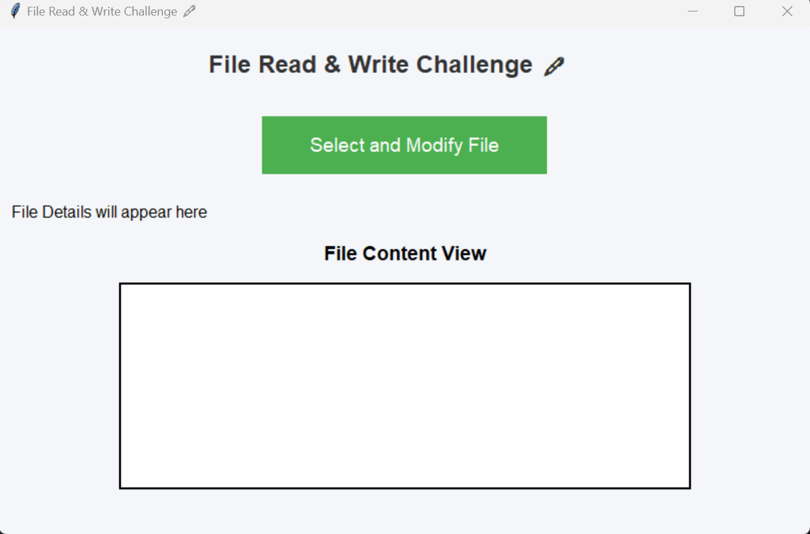
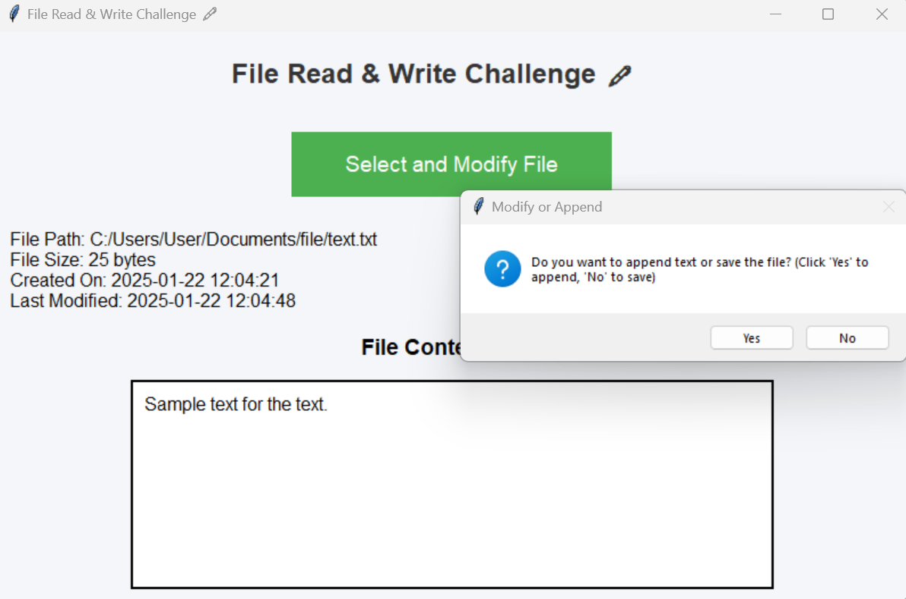
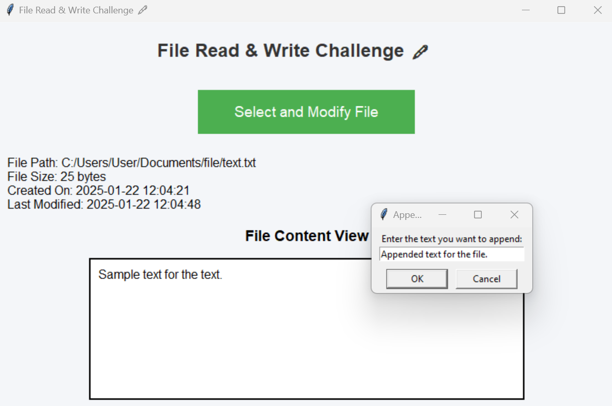

# File Read & Write Challenge 🖋️

This Python application allows users to **read and modify text files** using a graphical interface. You can select a file, view its contents, append new text, modify the content, and save it as a new file.

## Features 🎉

- **Load File**: Choose a file and view its details (path, size, creation date, and modification date).
- **Modify or Append**: Option to either append new content or modify the existing content.
- **Save File**: Save the modified content to a new file with the ability to select the destination path and file name.

## Technologies Used ⚙️

- Python 3.x
- Tkinter (for GUI)
- OS module (for file handling)
- `datetime` module (for displaying file timestamps)

## Installation 🚀

1. Clone the repository:
git clone https://github.com/aizocraft/WK4-File-Handling-and-Exception-Handling-Assignment.git

2. Navigate to the project directory

3. Run the program:
   python file.py

## How It Works 💻

### 1. Select a File:
Click on **"Select and Modify File"** to choose a text file from your system. File details such as path, size, creation date, and last modification date will be displayed.

### 2. Modify or Append Content:
After loading the file, you can either append new text to the end or modify the existing content. Use the input dialogs to enter new text or modify the current content.

### 3. Save the File:
After making changes, save the file to a new location. You will be prompted to select the destination path and file name for the modified file.

## Screenshots 📸

- **Main Interface**:  
  Click on "Select and Modify File" to start.
  

- **File Details & Content View**:  
  View file details and content here.
  

- **Append or Modify Text**:  
  Choose whether to append or modify the content.
    

## Code Overview 📂

The main functionality is implemented in the `file.py` file, which includes:

- File handling and modification
- Tkinter GUI for interacting with the user
- Functions for reading, appending, and saving file content

### Key Functions:
- `load_and_display_file()`: Loads the selected file, displays its content, and prompts the user to either append or modify the file.
- `append_or_save_file()`: Handles both appending new text or modifying existing content in the file.
- `get_file_details()`: Retrieves and formats the details of the selected file (size, creation date, modification date).

## Error Handling ⚠️

- **File Not Found**: If the user selects a non-existing or invalid file, an error message will be displayed.
- **Permission Denied**: If the file cannot be opened or modified due to permission issues, an error message will be shown.
- **Unexpected Errors**: Any unexpected issues will be caught and displayed as error messages.

## License 📝

This project is licensed under the **MIT License** 
